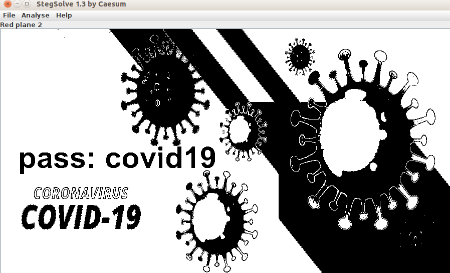
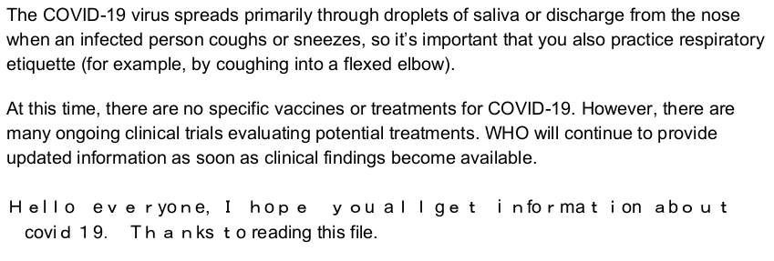

## Question

There is vaccine located as flag somewhere. Find it

## Solution

We are given a zip file which when extracted gives us 30 JPG files which look similar and a PDF which is password protected.
We try to inspect the differences between the files by running:

```
ls -l *.png
```

We can see that the image 30.jpg is considerably bigger than the others. So we open it stegsolve.jar and try different filters and get the password in RedPlane2 filter.

</br></br></br>

So we open the PDF and we check the PDF

</br></br></br>

We can see that the text given in the last 2 lines of the PDF are different and it seems like there are hidden characters between letters.
Deeper analysis led to us finding that the last 2 lines were indeed encrypted with Unicode homoglyphs. So I tried to extract the text from PDF using many websites and finally https://pdfcandy.com/ worked.
Once I extracted the text I used https://holloway.nz/steg/ to decode the text and reveal 99% of the flag. Due to the PDF to text conversion there were minor errors like spellings and format. Fixing those gave the right flag.