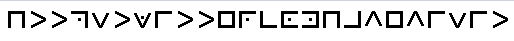
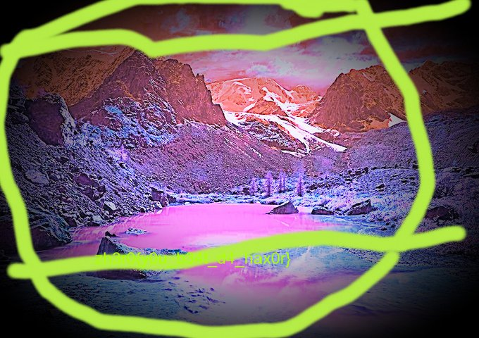

## Question

Hey FBI Agent! Hacker going by the name of al3xandr0vich1van has just hacked into NASA and it's been said that he will leak some critical information! Can you track him down for us? I would suggest you that you check his childhood days, we all posted stuff at that time...

## Solution

We are given the username al3xandr0vich1van, let's us try to run sherlock for this username 

```
python3.6 sherlock al3xandr0vich1van 
```

We get many results, one such link is: https://www.livelib.ru/reader/al3xandr0vich1van. Translating the page in English, we see a drive link attached at the bottom, there is a picture in the drive link
</br></br></br></br>

Seeing this, we can identify that the image uses pigpen cipher, let's decode it at https://crypto.interactive-maths.com/pigpen-cipher.html. We get a twitter link https://twitter.com/havevisit, visiting the link we see there is a picture with the flag in it
</br></br>